# Jarkom-Modul-2-F02-2023
Laporan resmi praktikum modul 2 jaringan komputer 2023

|NAMA|NRP|
|:--:|:-:|
|Moh Adib Syambudi|5025211017|

## Soal 1
#### Yudhistira akan digunakan sebagai DNS Master, Werkudara sebagai DNS Slave, Arjuna merupakan Load Balancer yang terdiri dari beberapa Web Server yaitu Prabakusuma, Abimanyu, dan Wisanggeni. Buatlah topologi dengan pembagian sebagai berikut. Folder topologi dapat diakses pada drive berikut 

Berikut adalah topologi yang kelompok kami gunakan 


Adapun konfigurasi untuk tiap node seperti berikut

Pandudewanata sebagai router

```
auto eth0
iface eth0 inet dhcp

auto eth1
iface eth1 inet static
	address 192.222.1.1
	netmask 255.255.255.0

auto eth2
iface eth2 inet static
	address 192.222.2.1
	netmask 255.255.255.0

auto eth3
iface eth3 inet static
	address 192.222.3.1
	netmask 255.255.255.0
```

Nakula sebagai client

```
auto eth0
iface eth0 inet static
	address 192.222.1.2
	netmask 255.255.255.0
	gateway 192.222.1.1
```

Sadewa sebagai client

```
auto eth0
iface eth0 inet static
	address 192.222.1.3
	netmask 255.255.255.0
	gateway 192.222.1.1
```

Yudishtira sebagai DNS master

```
auto eth0
iface eth0 inet static
	address 192.222.2.2
	netmask 255.255.255.0
	gateway 192.222.2.1
```

Werkudara sebagai DNS slave

```
auto eth0
iface eth0 inet static
	address 192.222.2.3
	netmask 255.255.255.0
	gateway 192.222.2.1
```

Arjuna sebagai load balancer

```
auto eth0
iface eth0 inet static
	address 192.222.3.2
	netmask 255.255.255.0
	gateway 192.222.3.1
```

Wisanggeni sebagai web server

```
auto eth0
iface eth0 inet static
	address 192.222.3.3
	netmask 255.255.255.0
	gateway 192.222.3.1
```

Abimanyu sebagai web server

```
auto eth0
iface eth0 inet static
	address 192.222.3.4
	netmask 255.255.255.0
	gateway 192.222.3.1
```

Prabukusuma sebagai web server

```
auto eth0
iface eth0 inet static
	address 192.222.3.5
	netmask 255.255.255.0
	gateway 192.222.3.1
```
Kemudian untuk testing topologi sudah berfungsi dengan baik kita lakukan ping pada google.com

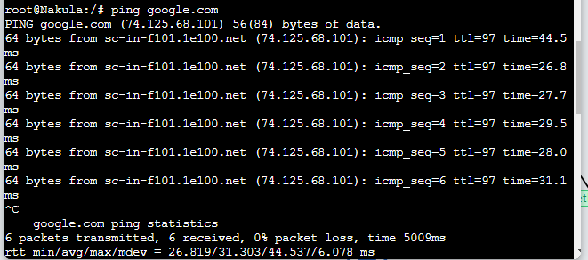

## Soal 2
#### Buatlah website utama pada node arjuna dengan akses ke arjuna.yyy.com dengan alias www.arjuna.yyy.com dengan yyy merupakan kode kelompok.

Proses pembuatan dari dns arjuna.f02.com dan alias www.arjuna.f02.com sebagai berikut

-Instalasi dari kebutuhan pembuatan dns yaitu package bind9 dengan command `apt-get install bind9 -y`
-Kemudian kita edit file `/etc/bind/named.conf.local` dengan isi seperti berikut:
```
zone "arjuna.f10.com" {
	type master;
	file "/etc/bind/praktikum2/arjuna.f10.com";
};
```
- Edit juga file konfigurasi untuk dnsnya dengan menyalin `file /etc/bind/db.local` kedalam `/etc/bind/praktikum2/arjuna.f02.com. Untuk dns menerjemahkan ip dari node load balancer arjuna yaitu 192.222.3.2 ubah file menjadi berikut:
```
; BIND data file for local loopback interface
;
$TTL	604800
@	IN	SOA	arjuna.f02.com. root.arjuna.f02.com. (
			2022100601		; Serial
			604800		; Refresh
			86400			; Retry
			2419200		; Expire
			604800 )		; Negative Cache TTL
;
@	IN	NS		arjuna.f02.com.
@	IN	A		192.222.3.2		; IP Arjuna
www	IN	CNAME		arjuna.f02.com
```
- Terakhir jalankan command `service bind9 restart`
- Percobaan dilakukan di client dengan ping ke arah dns yang telah dibuat yaitu arjuna.f02.com

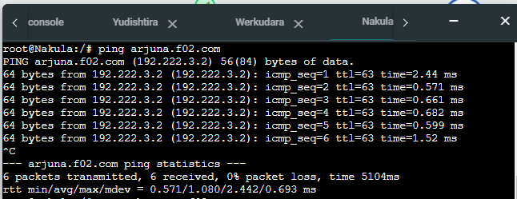

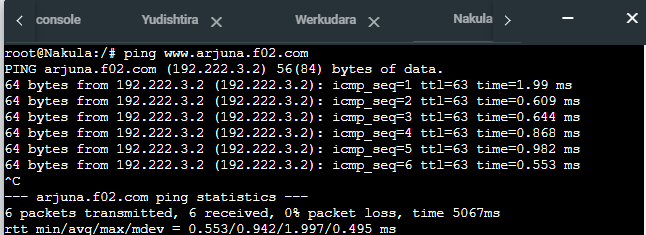

## Soal 3
#### Dengan cara yang sama seperti soal nomor 2, buatlah website utama dengan akses ke abimanyu.yyy.com dan alias www.abimanyu.yyy.com.

Dengan langkah yang sama dengan sebelumnya kita hanya perlu mengganti konfigurasi denngan abimanyu.f02.com yang mengarah ke node abimanyu dengan ip 192.222.3.4. Testingnya menggunakan client dengan ping menuju abimanyu.f02.com. Tambahkan juga konfigurasi berikut kedalam file `/etc/bind/named.conf.local`

```
zone "abimanyu.f02.com" {
	type master;
	file "/etc/bind/praktikum2/abimanyu.f02.com";
};
```

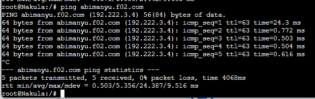

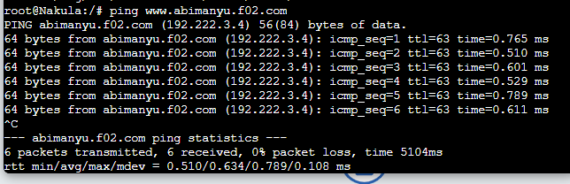

## Soal 4
#### Kemudian, karena terdapat beberapa web yang harus di-deploy, buatlah subdomain parikesit.abimanyu.yyy.com yang diatur DNS-nya di Yudhistira dan mengarah ke Abimanyu.

Subdomain dibuat dengan penambahan pada konfigurasi `etc/bind/praktikum2/abimanyu.f02.com` dengan menambahkan record berikut
```
parikesit	IN	A		192.222.3.4
```
Di uji dengan ping parikesit.abimanyu.f02.com di client

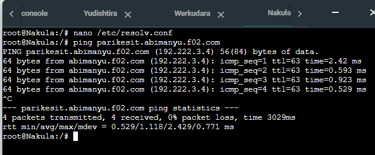

## Soal 5
#### Buat juga reverse domain untuk domain utama. (Abimanyu saja yang direverse)

- Reverse domain dibuat dengan menambahkan konfigurasi pada `/etc/bind/named.conf.local` dengan isi seperti berikut:
```
zone \"3.226.192.in-addr.arpa\" {
    type master;
    file \"/etc/bind/jarkom/3.222.192.in-addr.arpa\";
};
```
- Kemudian salin file `etc/bind/db.local` ke `/etc/bind/praktikum2/3.222.192.in-addr.arpa` dengan ubah isinya menjadi berikut:
```
; BIND data file for local loopback interface
;
$TTL	604800
@	IN	SOA	abimanyu.f02.com. root.abimanyu.f02.com. (
			2023101101		; Serial
			604800		; Refresh
			86400			; Retry
			2419200		; Expire
			604800 )		; Negative Cache TTL
;
3.222.192.in-addr.arpa.	IN	NS	abimanyu.f02.com.
4				IN	PTR	abimanyu.f02.com.	; Byte ke-4 Abimanyu'

```
- Restart bind9 dan install dnsutils untuk pengujian menggunakan command `host`. Pengujian dilakukan di client dengan
```
host -t PTR 192.222.3.4
```

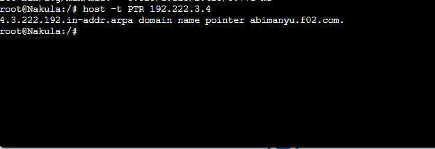

## Soal 6
#### Agar dapat tetap dihubungi ketika DNS Server Yudhistira bermasalah, buat juga Werkudara sebagai DNS Slave untuk domain utama.

- Pembuatan DNS Slave perlu mengubah konfigurasi pada `etc/bind/named.conf.local` dengan seperti berikut:
```
zone "arjuna.f02.com" {
	type master;
    notify yes;
	also-notify { 192.226.2.2; };	// IP Werkudara
    allow-transfer { 192.226.2.2; };	// IP Werkudara
	file "/etc/bind/praktikum2/arjuna.f02.com";
};

zone "abimanyu.f02.com" {
	type master;
    notify yes;
	also-notify { 192.222.2.2; };	// IP Werkudara
    allow-transfer { 192.222.2.2; };	// IP Werkudara
	file "/etc/bind/praktikum2/abimanyu.f02.com";
};

zone "3.222.192.in-addr.arpa" {
    type master;
	notify yes;
	also-notify { 192.222.2.2; };	// IP Werkudara
    allow-transfer { 192.222.2.2; };	// IP Werkudara
    file "/etc/bind/praktikum2/3.222.192.in-addr.arpa";
};
```
- Restart bind9 untuk mengaplikasikan perubahan
- Pada node Werkudara lakukan instalasi package yang sama dengan Yudishtira kemudian ubah pada `/etc/bind/named.conf.local`

```
zone "arjuna.f02.com" {
	type slave;
    masters { 192.222.2.2; }; // IP Yudhistira
	file "/var/lib/praktikum2/arjuna.f02.com";
};

zone "abimanyu.f02.com" {
	type slave;
    masters { 192.226.2.2; }; // IP Yudhistira
	file /var/lib/praktikum2/abimanyu.f02.com";
};

zone "3.222.192.in-addr.arpa" {
	type slave;
    masters { 192.222.2.2; }; // IP Yudhistira
	file /var/lib/praktikum2//3.226.192.in-addr.arpa";
};
```
- Restart bind9 dan matikan terlebih dahulu Yudhistira sebagai pengujian DNS slave berhasil dengan command `service bind9 stop`

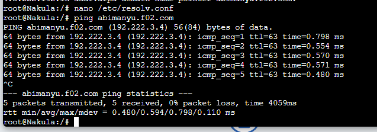

## Soal 7
#### Seperti yang kita tahu karena banyak sekali informasi yang harus diterima, buatlah subdomain khusus untuk perang yaitu baratayuda.abimanyu.yyy.com dengan alias www.baratayuda.abimanyu.yyy.com yang didelegasikan dari Yudhistira ke Werkudara dengan IP menuju ke Abimanyu dalam folder Baratayuda.

- Subdomain yang akan kita delegasikan dibuat dengan mengubah konfigurasi `/etc/bind/praktikum2/abimanyu.f02.com` dengan menambahkan record seperti berikut:
```
ns1		IN	A	192.222.2.3		; IP Werkudara
baratayuda	IN	NS	ns1
```
- Pada node yang didelegasikan kita ubah konfigurasi `/etc/bind/delegasi/praktikum2/baratayuda.abimanyu.f02.com` seperti berikut:
```
; BIND data file for local loopback interface
;
$TTL	604800
@	IN	SOA	baratayuda.abimanyu.f02.com. root.baratayuda.abimanyu.f02.com. (
			2023101101	; Serial
			604800		; Refresh
			86400		; Retry
			2419200		; Expire
			604800 )	; Negative Cache TTL
;
@	IN	NS	baratayuda.abimanyu.f10.com.
@	IN	A	192.222.3.4	; IP Abimanyu
www IN  CNAME   baratayuda.abimanyu.f02.com.'
```

- Ubah file `/etc/bind/named.conf.options` yaitu dengan  comment `dnssec-validation auto;` dan tambahkan `allow-query{any;};` dibawahnya
- tambahkan juga pada `etc/bind/named.conf.local` seperti berikut:
```
zone "baratayuda.abimanyu.f02.com" {
    type master;
    file "/etc/bind/delegasi/baratayuda.abimanyu.f02.com";
};
```
- Pengujian dilakukan dengan ping baratayuda.abimanyu.f02.com dan ping www.baratayuda.abimanyu.f02.com

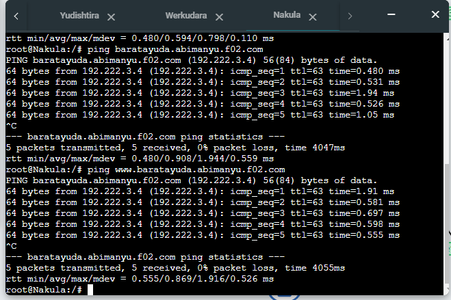

## Soal 8 
#### Untuk informasi yang lebih spesifik mengenai Ranjapan Baratayuda, buatlah subdomain melalui Werkudara dengan akses rjp.baratayuda.abimanyu.yyy.com dengan alias www.rjp.baratayuda.abimanyu.yyy.com yang mengarah ke Abimanyu.

Untuk membuat subdomain tersebut melalui werkudara kita hanya perlu menambahkan record berikut pada `/etc/bind/praktikum2/baratayuda.abimanyu.f02.com`
```
rjp	IN	A	192.222.3.4	; IP Abimanyu
www.rjp IN	CNAME	rjp.baratayuda.abimanyu.f02.com.
```

Berikut hasil pengujian

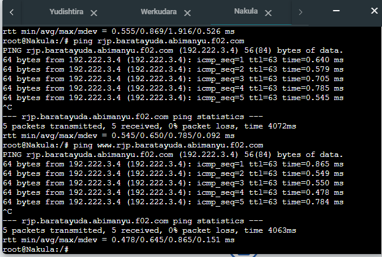

## Soal 9
#### Arjuna merupakan suatu Load Balancer Nginx dengan tiga worker (yang juga menggunakan nginx sebagai webserver) yaitu Prabakusuma, Abimanyu, dan Wisanggeni. Lakukan deployment pada masing-masing worker.

- Pada arjuna kita instal terlebih dahulu nginx dan bind9 dengan command
```
apt-get update
apt-get install nginx bind9 -y
```
- Kemudian pada tiap worker install nginx php dan php-fpm
```
apt-get update
apt-get install bind9 nginx -y
apt-get install php -y
apt-get install php-fpm -y

```

- Setelah semua keperluan siap, unduh file zip yang telah disediakan soal dengan wget dan extract hasil unduhan.
- Hapus file yang telah diekstrak untuk menghemat penyimpanan dan ganti nama file hasil ekstrak dengan arjuna.f02.com
- Buat file konfigurasi pada `/etc/nginx/sites-available` dengan nama arjuna yang berisi seperti berikut:
```
'server {

	listen 800x;

	root /var/www/arjuna.f02.com;

	index index.php index.html index.htm;
	server_name _;

	location / {
			try_files $uri $uri/ /index.php?$query_string;
	}

	# pass PHP scripts to FastCGI server
	location ~ \.php$ {
	include snippets/fastcgi-php.conf;
	fastcgi_pass unix:/run/php/php7.2-fpm.sock;
	}

location ~ /\.ht {
			deny all;
	}

	error_log /var/log/nginx/arjuna_error.log;
	access_log /var/log/nginx/arjuna_access.log;
}
```
- Port yang digunakan urut dari 8001-8003
- Nyalakan service dari php-fpm dengan `service php7.2-fpm start`
- buat symlink dengan command `ln -s /etc/nginx/sites-available/arjuna /etc/nginx/sites-enabled`
- restart nginx dan jalankan dengan command
```
service nginx restart
nginx -t
```

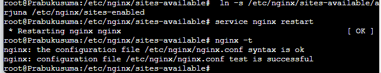

## Soal 10
#### Kemudian gunakan algoritma Round Robin untuk Load Balancer pada Arjuna. Gunakan server_name pada soal nomor 1. Untuk melakukan pengecekan akses alamat web tersebut kemudian pastikan worker yang digunakan untuk menangani permintaan akan berganti ganti secara acak. Untuk webserver di masing-masing worker wajib berjalan di port 8001-8003. Contoh- Prabakusuma:8001, Abimanyu:8002, Wisanggeni:8003

Buat konfigurasi pada directory `/etc/nginx/sites-available/lb-arjunaf02`
```
 # Default menggunakan Round Robin
upstream myweb  {
        server 192.222.3.3:8001; #IP Wisanggeni
        server 192.222.3.4:8002; #IP Abimanyu
        server 192.222.3.5:8003; #IP Prabukusuma
}

server {
        listen 80;
        server_name arjuna.f02.com;

        location / {
        proxy_pass http://myweb;
        }
}
```
kemudian buat symlink dengan command `ln -s /etc/nginx/sites-available/lb-arjunaf02 /etc/nginx/sites-enabled` dan restart nginx
pengujian dilakukan di client menggunakan lynx 


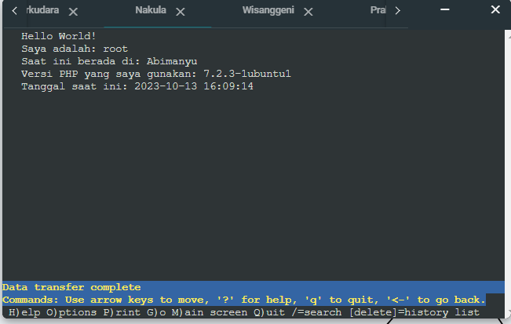

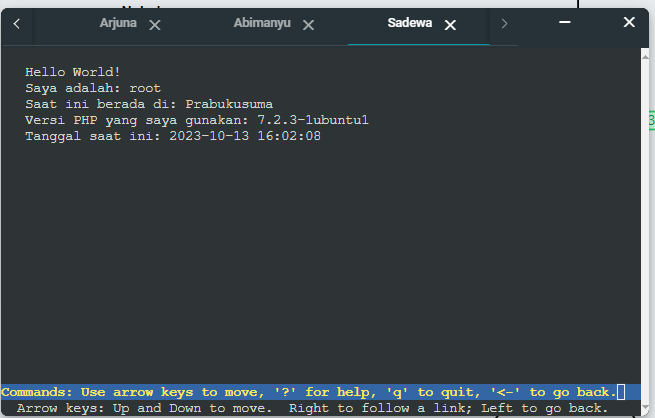

## Soal 11
#### Selain menggunakan Nginx, lakukan konfigurasi Apache Web Server pada worker Abimanyu dengan web server www.abimanyu.yyy.com. Pertama dibutuhkan web server dengan DocumentRoot pada /var/www/abimanyu.yyy

- Salin konfigurasi default apache (file 000-default.conf) pada folder "/etc/apache2/sites-available" dengan nama file "abimanyuf02.conf" ke folder yang sama 
- Mendownload resource dari google drive dan unzip ke folder "/var/www/abimanyu.f02" sebagai document root dengan command wget dan unzip
- Membuat konfigurasi abimanyuf02.conf seperti berikut:
```
<VirtualHost *:80>
        # The ServerName directive sets the request scheme, hostname and port that
        # the server uses to identify itself. This is used when creating
        # redirection URLs. In the context of virtual hosts, the ServerName
        # specifies what hostname must appear in the request's Host: header to
        # match this virtual host. For the default virtual host (this file) this
        # value is not decisive as it is used as a last resort host regardless.
        # However, you must set it for any further virtual host explicitly.
        #ServerName www.example.com

        ServerAdmin webmaster@localhost
        DocumentRoot /var/www/abimanyu.f02.com
	ServerName abimanyu.f02.com
	ServerAlias www.abimanyu.f02.com

        # Available loglevels: trace8, ..., trace1, debug, info, notice, warn,
        # error, crit, alert, emerg.
        # It is also possible to configure the loglevel for particular
        # modules, e.g.
        #LogLevel info ssl:warn

        ErrorLog \${APACHE_LOG_DIR}/error.log
        CustomLog \${APACHE_LOG_DIR}/access.log combined

        # For most configuration files from conf-available/, which are
        # enabled or disabled at a global level, it is possible to
        # include a line for only one particular virtual host. For example the
        # following line enables the CGI configuration for this host only
        # after it has been globally disabled with \"a2disconf\".
        #Include conf-available/serve-cgi-bin.conf
</VirtualHost>

# vim: syntax=apache ts=4 sw=4 sts=4 sr noet
```
- Mengaktifkan konfigurasi dengan perintah `a2ensite abimanyuf02`
- Merestart web server apache2 dengan perintah `service apache2 restart`

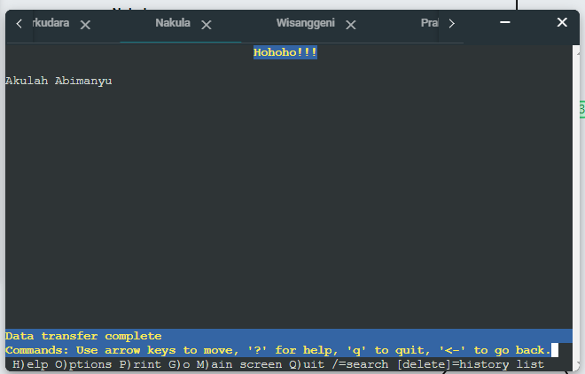

## Soal 12 
#### Setelah itu ubahlah agar url www.abimanyu.yyy.com/index.php/home menjadi www.abimanyu.yyy.com/home.

Ubah konfigurasi pada `/etc/apache2/sites-available/abimanyuf02.conf` dengan menambahkan baris berikut

```
Alias "/home" "/var/www/abimanyu.f02/index.php/home"
```
Kemudian restart dan akan menghasilkan seperti berikut


## Soal 13
#### Selain itu, pada subdomain www.parikesit.abimanyu.yyy.com, DocumentRoot disimpan pada /var/www/parikesit.abimanyu.yyy

Dengan langkah yang sama seperti dengan soal 11 dengan perubahan konfigurasi pada `/etc/apache2/sites-available/parkesitabimanyu.conf` dengan mengubah 
```
	ServerAdmin webmaster@localhost
        DocumentRoot /var/www/parikesit.abimanyu.f02.com
	ServerName parikesit.abimanyu.f02.com
	ServerAlias www.parikesit.abimanyu.f02.com
```

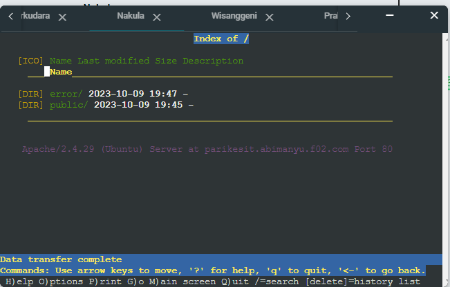

## Soal 14
#### Pada subdomain tersebut folder /public hanya dapat melakukan directory listing sedangkan pada folder /secret tidak dapat diakses (403 Forbidden).

Ubah kofigurasi pada `/etc/apache2/sites-available/parikesitabimanyu.conf` dengan menambahkan baris berikut
```
<Directory /var/www/parikesit.abimanyu.f02.com/public>
		Options +Indexes
</Directory>

<Directory /var/www/parikesit.abimanyu.f02.com/secret>
	Options -Indexes
</Directory>
```
Restart dan coba akses halaman secret maka akan menghasilkan 403 Forbidden

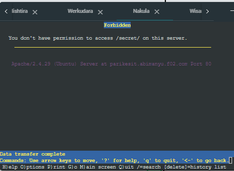

## Soal 15
#### Buatlah kustomisasi halaman error pada folder /error untuk mengganti error kode pada Apache. Error kode yang perlu diganti adalah 404 Not Found dan 403 Forbidden.

Ubah kofigurasi pada `/etc/apache2/sites-available/parikesitabimanyu.conf` dengan menambahkan baris berikut
```
ErrorDocument 403 /error/403.html
ErrorDocument 404 /error/404.html
```

kemudian restart dan uji coba dilakukan di client dengan 2 cara mengakses direktori secret untuk kode error 403 dan mengakses direktori adibsyam kode error 404
```
lynx parikesit.abimanyu.f02.com/secret
lynx parikesit.abimanyu.f02.com/adibsyam
```

Berikut adalah hasil error 403 forbidden

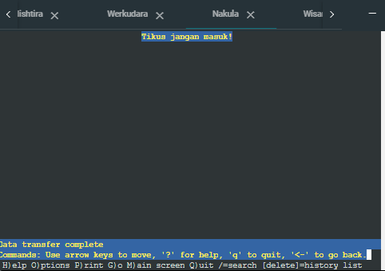

Berikut adalah hasil error 404 Not Found

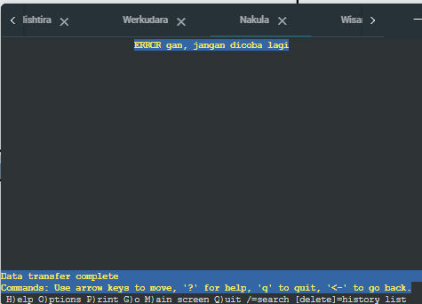

## Soal 16
#### Buatlah suatu konfigurasi virtual host agar file asset www.parikesit.abimanyu.yyy.com/public/js menjadi www.parikesit.abimanyu.yyy.com/js 

Ubah konfigurasi pada `/etc/apache2/sites-available/parikesitabimanyu.conf` dengan menambahkan baris berikut

```
Alias "/js" "/var/www/parikesit.abimanyu.f02,com/public/js"
```
Kemudian restart dan akan menghasilkan seperti berikut untuk alias js

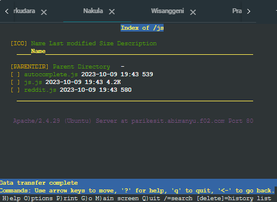

perbandingan dengan sebelumnya

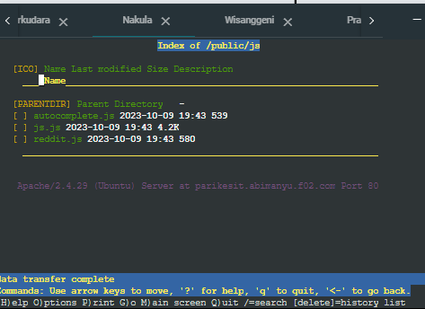

## Soal 17
#### Agar aman, buatlah konfigurasi agar www.rjp.baratayuda.abimanyu.yyy.com hanya dapat diakses melalui port 14000 dan 14400.

- Untuk konfigurasinya sama dengan abimanyu tetapi diubah pada menjadi `<listen *:14000 *14400>` dan diubah baris berikut:
```
 	ServerAdmin webmaster@localhost
        DocumentRoot /var/www/rjp.baratayuda.abimanyu.f02
	ServerName rjp.baratayuda.abimanyu.f02.com
	ServerAlias www.rjp.baratayuda.abimanyu.f02.com
```

- Kemudian tambahkan konfigurasi file `/etc/apache/ports.conf` dengan
```
Listen 14000
Listen 14400
```
- Untuk resource yang diperlukan kita dapatkan melalui wget dan kemudian di ekstrak
- restart apache untuk mengaktifkan konfigurasi terbaru
- Hasil pemgujian dengan menggunakan `lynx rjp.baratayuda.abimanyu.f02.com:14000`

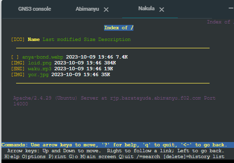

## Soal 18
#### Untuk mengaksesnya buatlah autentikasi username berupa “Wayang” dan password “baratayudayyy” dengan yyy merupakan kode kelompok. Letakkan DocumentRoot pada /var/www/rjp.baratayuda.abimanyu.yyy.

- Untuk membuat username wayang dan password yang diletakkan pada file "/etc/apache2/.htpasswd" menggunakan command
```
echo "baratayudaf10" | htpasswd -ci /etc/apache2/.htpasswd Wayang
```
- Mengaktifkan mode autentikasi dengan command `a2enmod auth_basic` dan `a2enmod authn_file`
- Menambahkan konfigurasi virtualHost file "rjp.baratayuda.abimanyu.f02.conf" seperti berikut:
```
<Directory /var/www/rjp.baratayuda.abimanyu.f02>
	AuthType Basic
	AuthName "Private Area"
	AuthUserFile /etc/apache2/.htpasswd
	Require valid-user
</Directory>
```
- Restart apache untuk mengaktifkan konfigurasi baru

Halaman login

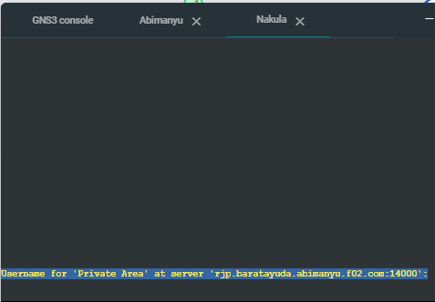

Memasukan password

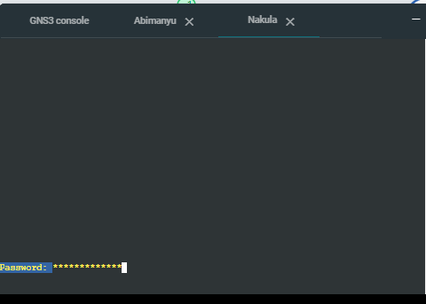

## Soal 19
#### Buatlah agar setiap kali mengakses IP dari Abimanyu akan secara otomatis dialihkan ke www.abimanyu.yyy.com (alias)

## Soal 20
#### Karena website www.parikesit.abimanyu.yyy.com semakin banyak pengunjung dan banyak gambar gambar random, maka ubahlah request gambar yang memiliki substring “abimanyu” akan diarahkan menuju abimanyu.png.
